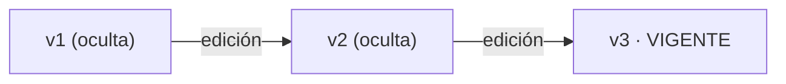

# Respuestas públicas y notas internas

Esta página reúne lo que un cliente de la API necesita saber para distinguir una **respuesta pública** de una **nota interna**, y para **editar notas internas**. El detalle campo a campo está en [threads-files](../endpoints/threads-files.md) y [tasks](../endpoints/tasks.md).

> **Alcance de la validación.** Lo descrito se leyó en el código del plugin y del núcleo de osTicket 1.17.2. La tabla [Qué está verificado por ejecución](#qué-está-verificado-por-ejecución-y-qué-solo-está-implementado) separa lo que tiene una comprobación ejecutable en el repositorio de lo que solo está implementado. Nada de esto se ha probado en producción ni con un cliente móvil.

## Respuesta pública frente a nota interna

| | Respuesta pública (`POST /tickets/{id}/replies`) | Nota interna (`POST /tickets/{id}/notes`) |
|---|---|---|
| Permiso | `ticket.reply` en el departamento del ticket | solo acceso al ticket (como el panel) |
| Audiencia | el cliente lo ve en el portal; puede llegar por correo | solo agentes |
| Correo | lo decide `notify` (obligatorio): `all` (dueño y colaboradores activos), `user` (solo el dueño) o `none` (ninguno) | ninguno por defecto; `alert:true` avisa por correo a los agentes |
| Copias | `cc` opcional: activa o desactiva colaboradores | no aplica |
| Efectos sobre el ticket | marca de respondido, `status_id` opcional, reclamo opcional (`claim`, sujeto a los ajustes del núcleo) | `note_status_id` opcional |
| Respuesta | `effects` con estado, asignación, `notify`, reclamo y caracteres eliminados | `effects` con `alert` y caracteres eliminados |
| ¿Editable? | **no** (ya se envió; se corrige con una respuesta nueva) | **sí**, con las reglas de abajo |

Los mensajes que escribe el cliente tampoco se pueden editar por la API.

## Editar notas internas

`PATCH /tickets/{id}/notes/{entry}` y `PATCH /tasks/{id}/notes/{entry}` (mismas reglas). Como toda escritura, exigen `Idempotency-Key`.

### Cuándo se puede y quién puede
- Solo si la entrada es una **nota interna**. Una respuesta pública o un mensaje del cliente devuelve `422 validation_failed` con `details.reason: "not_editable_type"`; una entrada del sistema, `422` con `details.reason: "system_entry"`; una entrada de otro hilo, `404`.
- Puede editar el **autor** de la nota, el **gerente del departamento** o un agente cuyo rol en ese departamento tenga `thread.edit`. Si no, `403 forbidden` con el permiso que falta.
- Orden de las comprobaciones: 404, tipo (422), entrada del sistema (422), permiso (403), versión (409). Un agente sin permiso que intenta editar una respuesta pública recibe 422, no 403.

### Petición
```json
{ "body": "texto corregido", "title": "opcional", "file_ids": [123] }
```
`body` es obligatorio; `body_format` (`text` por defecto o `html`), `title` y `file_ids` son opcionales. Si se omite `title`, se conserva. `{entry}` de la URL es la **versión que el cliente vio**.

### Versiones: la edición no muta, crea
Editar crea una **entrada nueva** enlazada a la anterior (`supersedes`), marcada `edited`, con el editor registrado y **la misma fecha de creación** (conserva su lugar en el hilo). El autor original no cambia. La versión anterior queda **oculta, nunca se borra**.



- `GET /tickets/{id}/activity` devuelve solo la versión vigente; con `include_hidden=1` devuelve también las ocultas con `hidden: true`.
- El orden se decide por `created` y luego por `id`; una edición tiene un `id` mayor pero la `created` de la nota original.
- Ediciones consecutivas del mismo agente **no se colapsan**: cada versión permanece como entrada oculta. Es una diferencia deliberada con el panel web de osTicket, que puede eliminar la edición intermedia. Así un cliente que sincronizó la versión N la encuentra oculta, no borrada.

### Respuesta
`200` con `{applied, entry, superseded_entry_id, sanitized}`. Si el texto y el título son idénticos y no se envían `file_ids`, no se crea versión: `applied: false` y `entry` es la actual. Enviar solo `file_ids` con el mismo texto **sí** crea una versión nueva.

### Errores y qué hacer
| Código | Significado | Acción del cliente |
|---|---|---|
| `409 conflict` con `details.current_entry_id` | la `{entry}` enviada ya no es la última versión | volver a leer la nota (`current_entry_id`; puede ser `null`), mostrar el texto vigente y reaplicar la edición sobre esa versión; es concurrencia optimista, no una edición destructiva |
| `422 not_editable_type` | respuesta pública o mensaje del cliente | no reintentar; publicar una respuesta nueva si hay que corregir |
| `422 system_entry` | entrada generada por el sistema | no reintentar |
| `403 forbidden` | falta autoría, gerencia o `thread.edit` | mostrar el permiso que falta |
| `404 not_found` | la entrada no pertenece a ese ticket o tarea | refrescar |
| `410 file_expired`, `409 attachment_missing` | problemas con `file_ids` (ver [Convenciones](Convenciones.md)) | subir el archivo de nuevo o completar con `POST …/notes/{entry}/files` |

### Adjuntos
Los adjuntos **no incrustados** de la versión anterior pasan a la nueva; los incrustados en el texto se quedan en la versión oculta. Los `file_ids` enviados se añaden a la nueva versión. Solo se puede referenciar archivos subidos por el mismo agente.

### Idempotencia
La misma `Idempotency-Key` con la misma petición devuelve la respuesta guardada (`Idempotent-Replayed: true`) y no crea otra versión. El mecanismo es el genérico del plugin para toda escritura.

### Correo
Editar una nota **no envía correo**.

## Qué está verificado por ejecución y qué solo está implementado

Verificado por ejecución = una comprobación ejecutable del repositorio (`prod-sandbox/e2e.py`, contra el sandbox tipo producción). `prod-sandbox/smoke.sh` (16 comprobaciones) no toca la edición de notas.

| Comportamiento | Estado |
|---|---|
| Edición aplicada: entrada nueva con `supersedes` y `edited` | verificado por `e2e.py` |
| Versión antigua → `409` con `current_entry_id` | verificado por `e2e.py` |
| Respuesta pública → `422 not_editable_type` | verificado por `e2e.py` |
| `include_hidden=1` conserva la versión anterior oculta (un salto) | verificado por `e2e.py` |
| Edición de una nota de tarea | verificado por `e2e.py` |
| Cadena de tres versiones | implementado; sin comprobación ejecutable en el repositorio |
| Texto idéntico sin versión nueva | implementado; sin comprobación ejecutable |
| `403` para un agente sin permiso | implementado; sin comprobación ejecutable |
| El autor edita la suya; un administrador edita la de otro agente | implementado; sin comprobación ejecutable |
| Autor original conservado | implementado; sin comprobación ejecutable |
| Adjuntos conservados y adjuntos nuevos | implementado; sin comprobación ejecutable |
| Misma `Idempotency-Key` → una versión | implementado (mecanismo genérico); sin comprobación ejecutable para esta ruta |
| Ningún correo al editar | implementado (el código no invoca el envío); sin comprobación ejecutable |

Las filas «sin comprobación ejecutable» pueden haberse observado a mano en el sandbox, pero no hay un script en el repositorio que las reproduzca.
